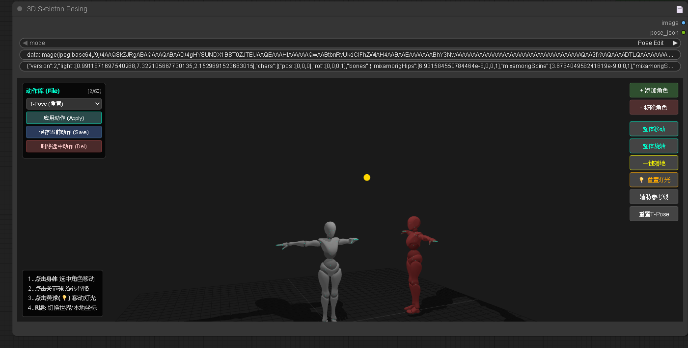

# ComfyUI 3D Pose Editor (Offline & Lighting Enhanced)



A professional 3D posing node for ComfyUI. Fully offline capable, with local pose library and interactive studio lighting control. Designed for ControlNet (OpenPose/Depth) workflows.

一个专业的 ComfyUI 3D 姿态编辑节点。支持完全离线运行、本地动作库管理以及交互式影棚打光控制。专为 ControlNet (OpenPose/Depth) 工作流设计。

---

## ✨ Key Features (核心功能)

*   **🌐 Fully Offline (完全离线)**:
    *   All dependencies (Three.js, Models, Loaders) are embedded locally.
    *   No internet connection or CDN required. Perfect for intranet/offline environments.
    *   内置所有依赖库和模型，无须联网加载 CDN，完美支持离线/内网环境。

*   **💡 Interactive Studio Lighting (交互式打光)**:
    *   **New!** Moveable point light source (represented by a yellow sphere).
    *   Create realistic shadows to enhance Depth map generation.
    *   **新增！** 可移动的点光源（黄色球体），自由调整光照方向，生成真实投影以优化深度图效果。

*   **💾 Local Pose Library (本地动作库)**:
    *   Save up to 60 custom poses permanently to `saved_poses.json`.
    *   One-click apply, save, and delete poses.
    *   支持保存 60 个自定义动作到本地文件，一键应用、保存或删除。

*   **🏃 Multi-Character Support (多角色支持)**:
    *   Add multiple characters to the same scene.
    *   Individual control for each character.
    *   支持在同一场景中添加和控制多个角色。

## 🛠️ Installation (安装)

1.  Navigate to your ComfyUI custom nodes directory:
    进入你的 ComfyUI 插件目录：
    ```bash
    cd ComfyUI/custom_nodes/
    ```

2.  Clone this repository:
    克隆本仓库：
    ```bash
    git clone https://github.com/xizhilang-lab/My_3D_Nodes.git
    ```

3.  Restart ComfyUI.
    重启 ComfyUI。

## 🎮 Controls (操作指南)

| Action (操作) | Mouse/Key (按键) | Description (说明) |
| :--- | :--- | :--- |
| **Rotate View (旋转视图)** | Left Click (Blank Area) | Drag on empty space to rotate camera. (空白处拖拽) |
| **Select Body (选中身体)** | Left Click (Body) | Click character body to select. (点击角色身体) |
| **Select Bone (选中骨骼)** | Left Click (Joint Sphere) | Click joint spheres to rotate limbs. (点击关节球旋转) |
| **Move Light (移动灯光)** | Left Click (**Yellow Bulb 💡**) | Click the yellow sphere to move light source. (点击黄色灯泡球移动光源) |
| **Toggle Coordinates (切换坐标)** | Key `R` | Switch between World/Local rotation space. (切换世界/本地坐标系) |
| **Toggle Mode (切换模式)** | Key `T` | Switch between Rotate/Translate gizmo. (切换旋转/移动工具) |
| **Deselect (取消选择)** | Key `ESC` | Deselect current object. (取消当前选中) |

## 📸 Usage Tips (使用技巧)

1.  **For ControlNet**: Connect the `image` output to a ControlNet Preprocessor (like Depth or OpenPose).
    **配合 ControlNet**: 将 `image` 输出连接到 ControlNet 预处理器（如 Depth 或 OpenPose）。
    
2.  **Lighting**: Move the yellow light sphere to change shadow direction. This adds depth to your generated images.
    **打光技巧**: 移动黄色灯光球改变阴影方向，这能为生成的图像增加体积感。

3.  **Snapshot**: The output image is automatically generated whenever you release the mouse. The helper gizmos (bones, lights) are automatically hidden in the final output.
    **自动截图**: 每次松开鼠标时自动生成输出图像。输出时会自动隐藏辅助线、骨骼球和光源球，只保留角色和阴影。

## 📄 License

MIT License.